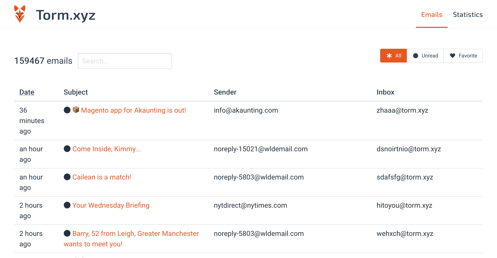
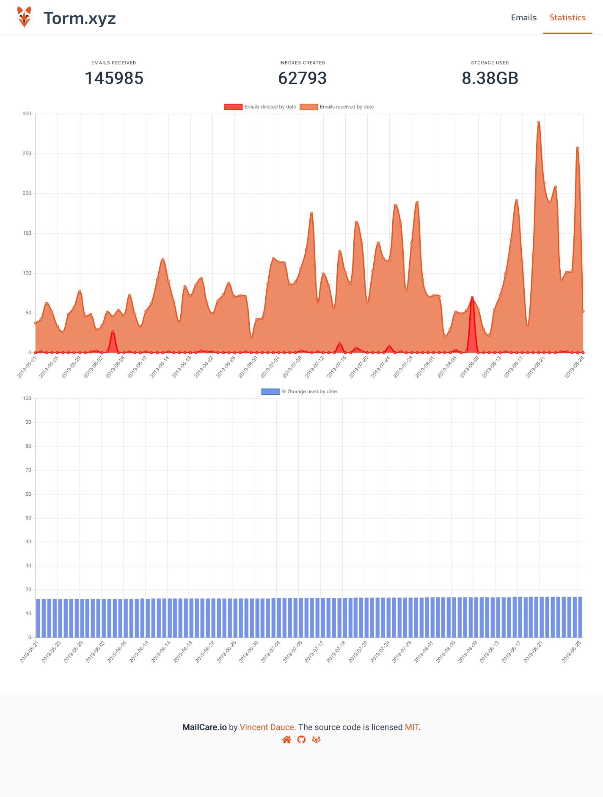
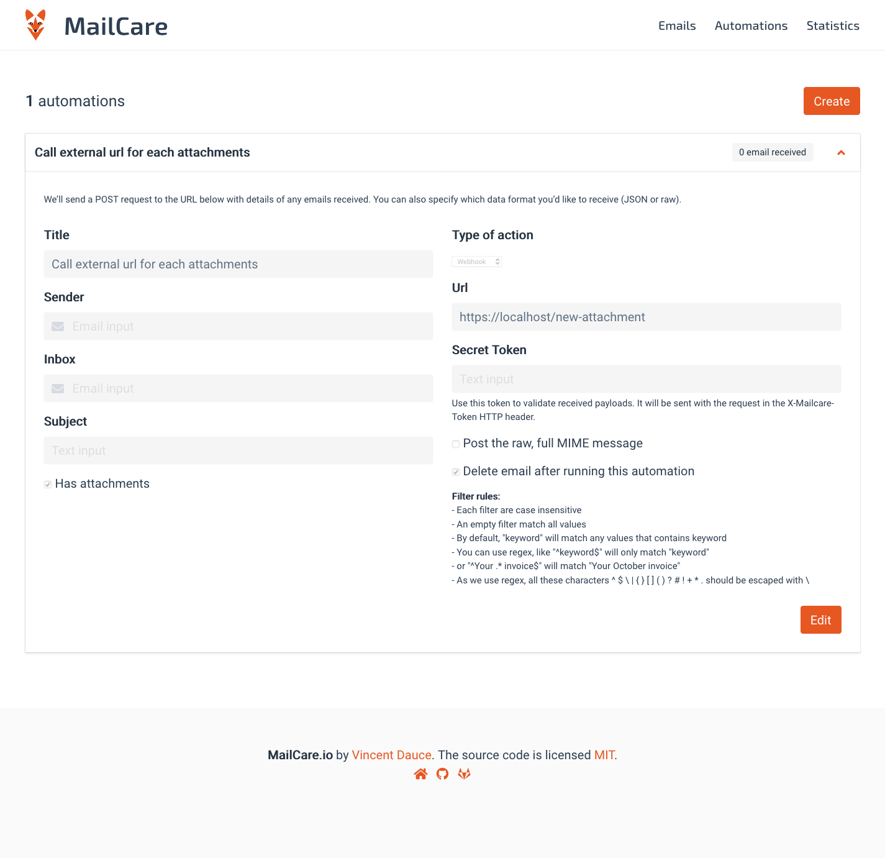

# MailCare [](https://gitlab.com/mailcare/mailcare/commits/master) [](https://gitlab.com/mailcare/mailcare/commits/master)

This is an open source disposable email address service that was built and maintained at mailcare.io.

## Installation

### Prerequisites

* To run this project, you must have PHP 7 installed and php-mailparse extension.
* Port 25 should be open from any IP address
* You should setup a host on your web server for your domain.

### Step 1

Begin by cloning this repository to your machine, and installing all Composer & NPM dependencies.

```bash
git clone git@gitlab.com:mailcare/mailcare.git
cd mailcare && composer install && npm install
php artisan mailcare:install
```

### Step 2

Next, configure your mail transfer agent (MTA) to catch all emails and route them to the php application mailcare. See bellow an example with Postfix that I personnally use.

```bash
sudo php artisan mailcare:configure-postfix /etc/postfix example.org forge
```

This script does 2 configurations

/etc/postfix/main.cf
> Replace the line `myhostname = *` by `myhostname = example.org`
> Add one new line `smtpd_recipient_restrictions = permit_mynetworks, reject_unauth_destination` for security purposes.
> Add one new line `local_recipient_maps =` to accept any mailbox under the domain myhostname

/etc/postfix/master.cf
> Add one new line `mailcare unix - n n - - pipe flags=F user=forge argv=php /home/forge/example.org/artisan mailcare:email-receive` to create a new hook named mailcare
> Replace the line `smtp      inet *` by `smtp      inet  n       -       -       -       -       smtpd -o content_filter=mailcare:dummy` to call this new hook each time you receive an email

and reload Postfix.


### Step 3

https://www.wormly.com/test-smtp-server


## Screenshots

### Emails




### Statistics



### Automations

